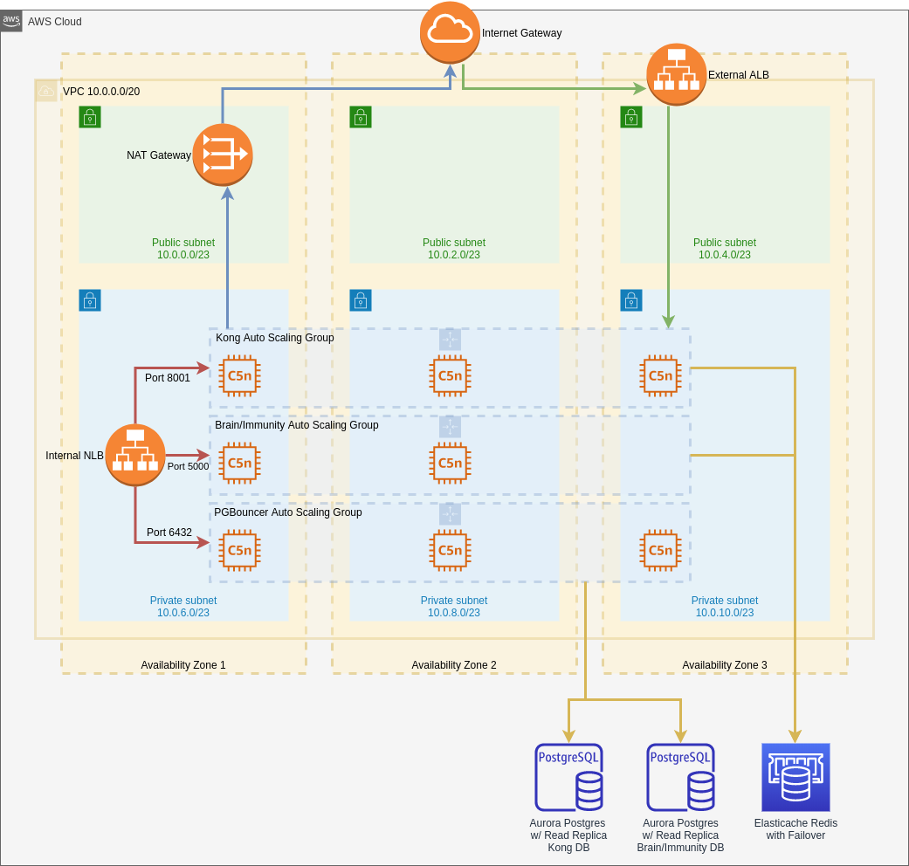
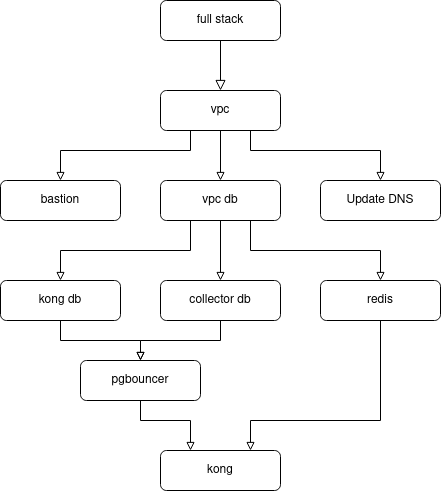

# kong-aws-cloudformation-template

This repository contains AWS CloudFormation templates that will create the infrastructure required to stand up a Kong cluster of EC2 nodes with Brain/Immunity enabled.

## What this template deploys

The following architecture diagram details what this template builds:



This template deploys the following infrastructure to AWS:

1. A VPC spanning three availability zones with 3 private subnets and 3 public subnets
2. An internet gateway for the VPC
3. An ALB V2 load balancer
4. A NAT Gateway that will ensure all traffic coming from Kong will have the same, static IP address
5. An internal network load balancer that will facilitate communication among Kong, Brain/Immunity, and PGBouncer auto scaling groups
6. An autoscaling group comprised of a Kong cluster. We recommend network-optimized EC2 instance types (c5n or r5n), especially for production deployments.
7. An autoscaling group comprised of EC2 nodes running Brain and Immunity in Docker. We recommend network-optimized EC2 instance types (c5n or r5n), especially for production deployments.
8. An autoscaling group comprised of a PGBouncer cluster. We recommend network-optimized EC2 instance types (c5n or r5n), especially for production deployments.
9. Two Aurora Postgres instances with read replicas. One is used by Kong, and the other is used by Brain/Immunity.
10. An Elasticache Redis instance with failover used by both Kong and Brain/Immunity
11. A linux bastion used to access Kong, Brain/Immunity, and PGBouncer nodes in private subnets. You may choose to deploy between 1 and 4 bastion EC2 instance(s).

This template also configures log rotation, as logs coming from Kong can, over time, fill up the volume space available to Kong nodes. You may configure logrotate options in the [kong](./configs/logrotate/kong) file in the /config/logrotate directory.

The following diagram details the order in which templates that are a child of the full-stack template are deployed:



## Prerequisites

In order to run this template in AWS, you will need to do some legwork. First, this template assumes you have Kong enterprise license. You can find CloudFormation templates in GitHub that are designed for use with Kong's open source
offerings. That's the first thing that makes this template different from others you might find out in the wild.

Here are some other things you're going to have to take care of before installing this template:

1. You need an AWS account. Maybe this is obvious, but we'll state it explicitly anyway.
2. You need an S3 bucket in AWS where you'll upload templates that are a child of the [full-stack.yaml](./templates/full-stack.yaml) template found in this repo. This means you'll also have to update the full-stack.yaml file (search for `<URI_to_S3_bucket>`) to have the child templates point to S3 using the `TemplateURL` property in the yaml file. This is required, because AWS does not allow very large templates to be run via the AWS CLI, so we split the template into its component pieces, created a top-level template, and referenced the child templates from S3. Simply copy the contents of the `templates` folder, excluding the full-stack.yaml file, to a `templates` folder in your S3 bucket. We feel it would be fine to make this bucket public, as there is no sensitive information in the template yaml files.
3. You need an S3 bucket to store basic configuration files that are consumed by the template. You may use the same bucket as the one we created in the step above, having a `configs` directory within the bucket to separate the template files from the configuration files. Copy the contents of the `configs` folder to the `configs` folder in your S3 bucket. We feel it would be fine to make this bucket public, as there is no sensitive information in the configuration files. Then you'll have to update all references in this template to `<URI_to_S3_bucket>` to reflect the URI of the bucket you created.
4. You need a domain. This also seems obvious. It doesn't matter where your domain comes from, as long as you own it. If your domain is managed using Route53 in the same AWS account as the one where you're deploying this template, this template will update your DNS records to point to the load balancer. If your domain is managed outside of the AWS account where you're deploying this template, send `false` as the `UpdateDNS` parameter, and update DNS yourself once the template has completed.
5. You need an AWS Certificate Manager (ACM) certificate to apply to the application load balancer. The cert should have `<subdomain>.<domain>` as the primary name, and you should add `*.<subdomain>.<domain>` as a subject alternative name. For example, you might have `api.mycompany.com` and `*.api.mycompany.com`. The ARN of the ACM certificate is a parameter to the template.
6. You need SMTP. Kong sends emails in response to requests for access. The SMTP parameters to this template are optional, but you will not have a fully-functional Kong instance if Kong can't send emails. We are using the AWS Simple Email Service (SES).
7. You need an EC2 Key Pair you'll use to access your Kong, Brain/Immunity, and PGBouncer nodes. Add one prior to running the template, and pass the Key Pair in as the `KongKeyName` parameter.

## Parameters

Yes. You're right. There are a lot of parameters, but keep in mind this template is doing a lot of work. The following is a synopsis of the most important parameters you'll have to provide in order for the template to successfully deploy:

* KongEnterpriseAccount: This string specifies the username of your Kong enterprise account. This is the username you use to log into bintray.com to access your Kong installs and licenses.

* KongEnterprisePassword: This string specifies the password of your Kong enterprise account. This is the password you use to log into bintray.com to access your Kong installs and licenses.

* KongEnterpriseLicensePath: This is the path to your license file in bintray.com. You can determine this by downloading your license file from bintray.com and by analyzing the URL that was used to do the file download (using browser development tools). Typically, the URL will be something like `https://bintray.com/api/ui/download/kong/<your_company_name>/ex01012020.license.json`. If this were the URL you would specify `<your_company_name>/ex01012020.license.json` as this parameter's value.

* HostedZoneName: The base domain of your site. This will be something like `api.yourcompany.com`.

* Subdomain: The subdomain of your site. For instance, you could use `dev` for your development environment. Someone trying to reach an API would call `dev.api.yourcompany.com`.

* KongTLSCertArn: The AWS arn of the cert you'll use for TLS on your load balancer

* KongKeyName: This is the name of the pem file (key pair created in EC2) you'll use to connect to the linux bastion that will give you access to ssh into the AWS nodes running Kong, Brain/Immunity, and PGBouncer.

* KongAdminPassword: The password you'll use to log into the Kong site in a browser

* DBPassword: The password you'll use to secure your Kong Aurora Postgres instance

* CollectorPassword: The password you'll use to secure your Collector (for Brain and Immunity) Aurora Postgres instance

* RedisPassword: The password you'll use to secure your ElastiCache Redis instance (for Brain, Immunity, and Kong Rate Limiting plugin)

* SMTPHost: The host specified in SES for SMTP. Should be something like `email-smtp.<AWS_Region>.amazonaws.com`

* SMTPUsername: The IAM access key needed for Kong to use SES SMTP

* SMPTPassword: The IAM secret access key for Kong to use SES SMTP

* SMTPDomain: SMTP domain you'll find in AWS SES under the "Domains" tab

* SMTPAdminEmails: The email addresses of the SES admins you've created. You'll find those in the "Email Addresses" tab of AWS SES.

* EmailsFrom: The address you want to see in emails sent to users. This will be something like "Kong Admin <admin@api.yourcompany.com>"

* EmailsReplyTo: The reply address users will see in emails they receive. This will be something like "No Reply <no-reply@api.yourcompany.com>", because users shouldn't be able to reply to automated emails.

We have provided two example parameter files in the `parameters` folder. The first, kong-enterprise-prod.parameters, contains recommended settings for running a large-scale, enterprise, production Kong cluster. The second, kong-enterprise-small.parameters, contains recommended settings for running a smaller-scale, development Kong cluster.

## Running the template

Of course, you can use the CloudFormation user interface, supplying the full-stack.yaml as the template file, to kick off this template.

You may also use the AWS CLI V2 to kick off this template with a command similar to the following:

```bash
aws cloudformation create-stack \
--template-body file://<path_to_full-stack.yaml> \
--parameters file://<path_to_parameters_file.json> \
--capabilities CAPABILITY_IAM \
--stack-name <stack_name>
```

We also like to add the `--disable-rollback` option to this call, because you know how it goes in CloudFormation ... it never works the first time.  And if the deployment does not roll back, you have the option to take a closer look to see what went wrong.

## Logging into Kong

Once your template completes successfully, simply visit the `Outputs` tab of the `KongStack` child stack in CloudFormation. That tab will contain an output called `AdminGuiURL`. Simply click that URL, supply `kong_admin` as the user, and supply the `KongAdminPassword` from your parameters as the password to the website.

## Debugging your Kong instance

To determine if there was a problem with the auto scaling group initialization script, run the following command once you have an ssh session connected to one of the Kong nodes.

```bash
cat /var/log/cloud-init-output.log
```

Additional logs may be found in `/usr/local/kong/logs`.

To view all the environment variables Kong is using, run the following:

```bash
sudo cat /usr/local/kong/.kong_env
```

We also write out a file that can be used to source all environment variables we set when a node is constructed by the auto scaling group initialization script. It is located at root, so you must sudo to see it.

```bash
sudo su -
cd /root
cat kong-env
```

## Restarting Kong manually on a node

If you make changes to configuration or other changes to Kong, you might have to restart it. To manually restart Kong on a given node, run the following:

```bash
sudo su -
cd /root
source kong-env
/usr/local/bin/kong restart
```

IT IS VERY IMPORTANT THAT YOU SOURCE THE kong-env FILE. IF YOU DO NOT, KONG WILL NOT HAVE ALL THE VALUES IT NEEDS TO START SUCCESSFULLY.
